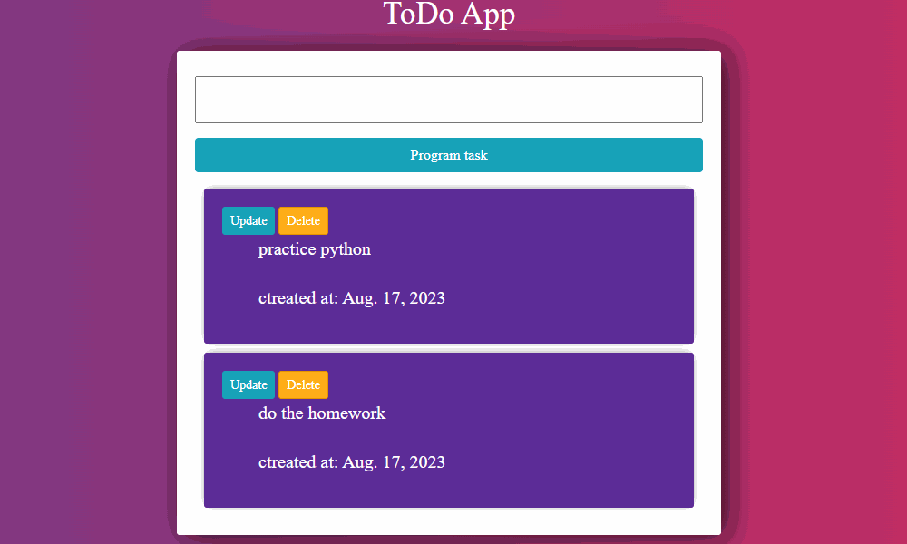
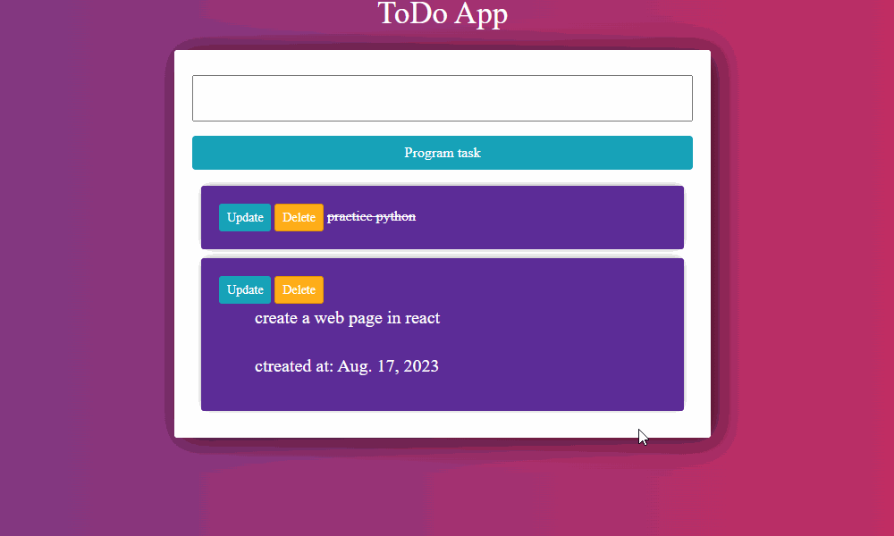

# ToDo App List
ToDo App List es una aplicación web para programar tareas, permite listar, eliminar y actualizar dichas tareas.
## Tecnologías usadas

 ● Python versión 3.8.5
 
 ● Framework Django versión 4.2.4
 
 ● CSS y Bootstrap

 ● SQLite

 ## Configuraciones
 La App se creo dentro de un entorno virtual de python para evitar que las librerias y dependencias  no intervinieran con las principales del Sistema operativo.
## Instalación
1. Clona este repositorio: `https://github.com/AndresSilverall/todoApp.git`
2. Navega a la carpeta del proyecto: `cd mi-proyecto`
3. Crea un entorno virtual: `python -m venv venv`
4. Activa el entorno virtual: 
   - En Windows: `venv\Scripts\activate`
   - En macOS y Linux: `source venv/bin/activate`
5. Aplica las migraciones de la base de datos: `python manage.py migrate`
   
## Uso
1. Ejecuta el servidor de desarrollo: `python manage.py runserver`
2. Abre tu navegador y ve a: `http://127.0.0.1:8000/`
   
## funcionamiento

   
  

